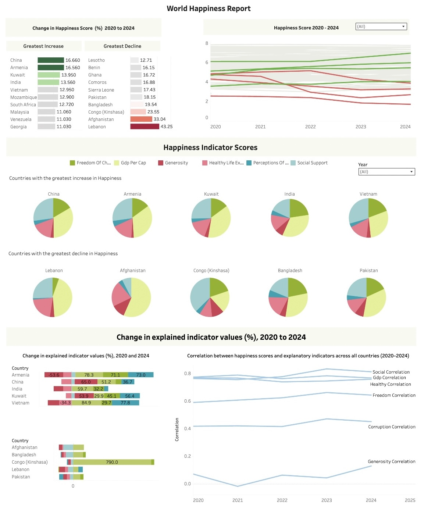

# World Happiness Report
World Happiness Report 2020 - 2024 Data analysis

# **Introduction**

The World Happiness report is a global publication that assesses the well being of a country. The report exists to create a greater understanding of how happiness can be achieved and the importance of different socio-economic factors in order to achieve both social and economic development. The report uses a standardized method to ensure comparability across the data set.

# **Variables included in the data set**  
* **Country Name:** Name of the country.  
* **Happiness Rank:** Rank of the country based on the Happiness Score.  
* **Happiness Score:** A metric measured by asking the sampled people to rate their happiness on a scale of 1 to 10 with 10 being happiest.  
* **Upperwhisker:** This variable represents the upper limit of the happiness score based on the confidence interval of 95%.  
* **Lowerwhisker:** This variable represents the lower limit of the happiness score based on the confidence interval of 95%.  
* **Economy (GDP per Capita):** Portion of a country's average happiness score that is statistically attributed to its logged GDP per capita.  
* **Social support:** Feeling of having someone to count on or people to rely on for support.  
* **Healthy life expectancy:** Average number of years a person can expect to live in good health.  
* **Freedom to make life choices:** Feeling of autonomy or control over one's life decisions.  
* **Generosity:** The willingness of people to help others.  
* **Perceptions of corruption:** Perceived level of corruption throughout Government and within business.  

___
# **Project Overview**  
The purpose of this project is to take a closer look at the subjectivity of happiness worldwide. The data used has been taken for The World happiness Reports of 2020, 2021, 2022 and 2023.  

# **Objectives:**  
*Extract and import data into Postgresql database.  
*Clean data to ensure accuracy.  
*Explore and analyse the data to identify trends within and between each data set.  
*Use the data analysis finding to create explanatory visuals to provide greater insight.  
*Identify the varying impact of social-economic indicators across the world and factors that could lead to a potential increase in happiness.    

# **Data sources**  
World Happiness Report (2020-2024):
https://www.kaggle.com/datasets/samithsachidanandan/world-happiness-report-2020-2024

# **Tools Used:**  
Postgresql
Tableau

# **Methodology**
Extract data from zip file and create a table in Postgresql ready to import data.
Clean data by identifying duplicates and deleting rows if key values were Null. Only 3 rows from row 2024 were removed.
Using subqueries, joins, unions, CTE’s and window functions to analyse data and create a deeper insight.
Using Tableau tool to create deeper insight through visualisation.
Use the analysis from Postgresql to present findings .

___

# **QUESTIONS**

1) What was the average happiness score across all countries in 2020?  
2) Determine what percentage of countries were above the average score and what percentage were below in 2020.  
3) Compare the happiness averages and percentages in 2024 against that of 2020.  Which year had the highest average happiness score recorded and which had the lowest?  
4) Compare the happiness averages and percentages across the 5 year period.  Which year had the highest average happiness score recorded and which had the lowest?  
5) Determine the coefficient of correlation between the happiness score and each key variable using the 30 happiest and least happiest countries according to happiness score in 2020 (The year with the lowest average happiness score).    
6) Determine the coefficient of correlation between the happiness score and each key variables using the 30 happiest and least happiest countries in 2022 (The year with the highest average happiness score).   
7) Determine the coefficient of correlation between the happiness score and each key variables using the 30 happiest and least happiest countries over the 5 year period.   
8) a) Identify which 15 countries have the highest incline in happiness according to its happiness score from 2020 to 2024. (Only include countries that are present in both data sets)  
b) Among these countries which variable experienced the greatest incline (%)?    
9) a)Identify which 15 countries had the smallest incline/greatest decline in happiness according to its happiness score from 2020 to 2024.  
b) Amongst these countries which variable experienced the greatest decline (%)?  

___

# **INSIGHTS**

1. For 2020 the average happiness score in 2022 was 5.554

2. The majority of countries recorded a happiness score greater than the average for 2020 but the majority was slight, at 52%.

3. The average happiness score increased from 2020 to 2024, the amount of countries that experienced happiness above this average also increased to 56%.

4. The average happiness score experiences little changes and small fluctuations throughout the 5 year period. 2022 has the highest average score recorded.

5. Among the 30 countries deemed happiest in 2020, there is a positive correlation coefficient between the happiness score and each variable. The strongest positive relationship being with perceptions of corruption followed by social support then freedom to make life choices. All indicators contribute towards happiness for these countries and provide a focal point for improvement.
Predictors of happiness are weak for the 30 least happiest countries. The results indicate a nonlinear relationship suggesting that key indicators of happiness lie outside of the report. The strongest relationship being with social support, which had a correlation coefficient 0.48. Although social support does serve as an indicator,  strong indicators that remain unmeasured are likely to exist

6. Among the 30 happiest and least happiest countries of 2022 the strongest indicator of happiness is social support. The correlation with all others indicators is weak amongst the unhappiest countries with a nonlinear relationship displayed.

7. The correlation between the indicators and happiness score has weakened for the 30 happiest countries, particularly perceptions of corruption, generosity and GDP Per Capita.

8. Among the 15 countries that experienced the greatest increase in their happiness scores, most were originally ranked in the lower quartile of the global happiness index. The increased ranged from 8% to 17%. The majority of these countries experienced a rise in GDP Per Capita, increased feeling of freedom and a reduced perception of corruption and a significant decline in generosity and healthy life expectancy.

9. Among the 15 countries that experienced the greatest decrease in their happiness scores, a high majority originally ranked in the lower quartile of the global happiness index. The decreased ranged from -7% to -44%. There was a significant decline in social support, generosity and healthy life expectancy. A more promininent rise in GDP Per Capita was also experienced.

    
Interact with the dashboard here: https://public.tableau.com/app/profile/kemi.hinkson.adewunmi/viz/worldhappiness_17465373087460/Dashboard1 

